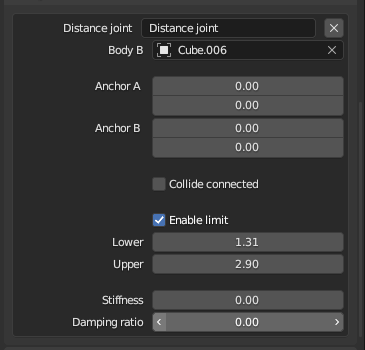

# Blender Box2D

Blender Box 2D is a blender plugin that helps integrate a scene with Box 2D physics engine. It allows to edit object physics properties like rigid bodies and joints in blender using custom panel and gizmos. Physics properties are exportable through custom properties. This plugin has been mainly used with gltf in mind and has been tested with ThreeJS application (ThreeJS typescript package will be available), but it can be used in engine that can parse GLTF and initiate box2D physics through GLTS extra properties (more details in data section).


## Supported feature

### Tools

An extra view 3D panel is available with shortcut operators and visibility options


### Scene settings

Allow to enabled box2D and set world settings, it is availabled in scene panel


### Scene 3D > Physics 2D Transform

Most coordinate  properties for joint and shapes are set in object local coordinate space and are converted to 2D space based on scene orientation property. in order to display gizmos and geometry in proper space object reference world matrix is clamped and converted in box 2D space

!! Object transform can cause display issues if object scaled in the sames direction as box2D axes (eg scale X = 0.5 or scame Y = 2 when box 2D is in Z Plan). A better world matrix conversion will have to be set in order to avoid these issues.


### Rigid body

Rigid body panel enabled to edit rigid body props. Rigid body is in geometry level in order to use the same body definition in many objects


### Shapes

Shapes are sub property of a body, for each rigid body many shapes can be added

#### Box


#### Circle


#### Poly


Use semi transparent dot to add extra vertices and double click on existing vertex to delete it.


### Joints

Joints allow link object in each over. Joints are defined in Object level and added to an object by selecting two object, object body A will be owner of the joint and object body B will set as joint body_b property.

#### Revolute joint

!! limit preview / edit in view is not supported (only panel prop for now)


#### Distance joint

!! limit edit in view is not supported (only panel prop and preview are supported for now)




#### Prismatic joint

!! limit edit in view is not supported (only panel prop and preview are supported for now)


#### Wheel joint

!! limit edit in view is not supported (only panel prop and preview are supported for now)


## Data structure

JSON object structure based on custom props definition and get from gltf export
Boolean props are represented as integer (maybe gltf export limitation) 

```json
// body in primitive level 
"extras":{
    "three_rigid_body_2d":{
        "enabled":1,
        "shapes":[
            {
                "shape_type":1
            }
        ],
        "bullet":1,
        "fixed_rotation":1,
        "linear_damping":1.0,
        "angular_damping":1.0,
        "linear_velocity":[
            1.0,
            1.0
        ],
        "angular_velocity":1.0
    }
},
```

### Shapes

!! Polygon shape are not splitted in divides in convex polygons, but box2D require it

!! object relation seems to perfectly work with gltf export as object duplicate are names Object.001 and are defined as object001 when exported. If joint relation breaks renaming object in blender will fix the issue

```json
{

// in body
"shapes":[
        // polygon
        {
            "shape_type":3, // polies : 3
            "shape_polygon_vertices":[
                {
                    "pos":[
                        0.39315104484558105,
                        1.4528932571411133
                    ]
                },
                {
                    "pos":[
                        -1.6089258193969727,
                        1.4365148544311523
                    ]
                },
                {
                    "pos":[
                        -1.5827815532684326,
                        0.3900276720523834
                    ]
                },
                // ...
            ]
        },

        // circle : type = 2
        {
            "shape_type":2,
            "shape_position":[
                2.4853498935699463,
                0.6178200244903564
            ],
            "shape_radius":1.5,
            "mass":1.0,
            "friction":2.0,
            "restitution":2.0,
            "density":2.0,
            "filter_category_bits":2,
            "sensor":1,
            "filter_mask_bits":10,
            "filter_group_index":2
        },
        // box : shape = 1
        {
            "shape_type":1,
            "shape_position":[
                2.38706111907959,
                -1.5164929628372192
            ],
            "shape_box_scale":[
                2.0,
                2.0
            ],
            "shape_angle":-23.735509872436523,
            "friction":2.0,
            "restitution":2.0,
            "density":2.0,
            "filter_category_bits":2,
            "filter_mask_bits":10,
            "filter_group_index":2
        }
    ]
}
```

### Joints


```json
// in object level
"extras":{
    "physics_2d_joints":{
        // Revolute joint
        "revolute_joints":[
            {
                "body_b":{
                    "name":"Cube.001",
                    "type":"Object"
                },
                "anchor_a":[
                    0.0,
                    -1.9999998807907104
                ],
                "collide_connected":1,
                "enable_limit":1,
                "lower_angle":0.0,
                "upper_angle":10.0,
                "reference_angle":2.0,
                "enable_motor":1,
                "motor_speed":1.0,
                "max_motor_torque":2.0
            }
        ],

        // Distance joint
        "distance_joints":[
            {
                "body_b":{
                    "name":"Cube.006",
                    "type":"Object"
                },
                "enable_limit":1,
                "lower":1.309999942779541,
                "upper":2.9000000953674316,
                "collide_connected":1,
                "anchor_a":[
                    1.0,
                    2.0
                ],
                "anchor_b":[
                    3.0,
                    4.0
                ],
                "stiffness":2.0,
                "damping_ratio":4.0
            }
        ],


        // Prismatic joint
        "prismatic_joints":[
            {
                "body_b":{
                    "name":"Cube.008",
                    "type":"Object"
                },
                "anchor_a":[
                    0.5399999618530273,
                    -1.9999998807907104
                ],
                "local_axis":[
                    0.9953472018241882,
                    -0.26096877455711365
                ],
                "enable_limit":1,
                "lower":-0.1499999761581421,
                "upper":1.7400000095367432,
                "collide_connected":1,
                "enable_motor":1,
                "motor_speed":0.20999999344348907
            }
        ],

        // Wheel joint
        "wheel_joints":[
            {
                "body_b":{
                    "name":"Cube.010",
                    "type":"Object"
                },
                "anchor_a":[
                    0.17999999225139618,
                    -1.6099998950958252
                ],
                "local_axis":[
                    0.2999999523162842,
                    1.2999999523162842
                ],
                "enable_limit":1,
                "lower":0.1499999761581421,
                "upper":0.5099999904632568,
                "collide_connected":1,
                "enable_motor":1,
                "motor_speed":0.32999998331069946,
                "max_motor_torque":0.41999998688697815,
                "damping_ratio":0.5399999618530273
            }
        ]
    }
    // ....
}

```


## License

The MIT License (MIT)

Copyright (c) 2023-present Gilles Boisson

Permission is hereby granted, free of charge, to any person obtaining a copy
of this software and associated documentation files (the "Software"), to deal
in the Software without restriction, including without limitation the rights
to use, copy, modify, merge, publish, distribute, sublicense, and/or sell
copies of the Software, and to permit persons to whom the Software is
furnished to do so, subject to the following conditions:

The above copyright notice and this permission notice shall be included in all
copies or substantial portions of the Software.

THE SOFTWARE IS PROVIDED "AS IS", WITHOUT WARRANTY OF ANY KIND, EXPRESS OR
IMPLIED, INCLUDING BUT NOT LIMITED TO THE WARRANTIES OF MERCHANTABILITY,
FITNESS FOR A PARTICULAR PURPOSE AND NONINFRINGEMENT. IN NO EVENT SHALL THE
AUTHORS OR COPYRIGHT HOLDERS BE LIABLE FOR ANY CLAIM, DAMAGES OR OTHER
LIABILITY, WHETHER IN AN ACTION OF CONTRACT, TORT OR OTHERWISE, ARISING FROM,
OUT OF OR IN CONNECTION WITH THE SOFTWARE OR THE USE OR OTHER DEALINGS IN THE
SOFTWARE.